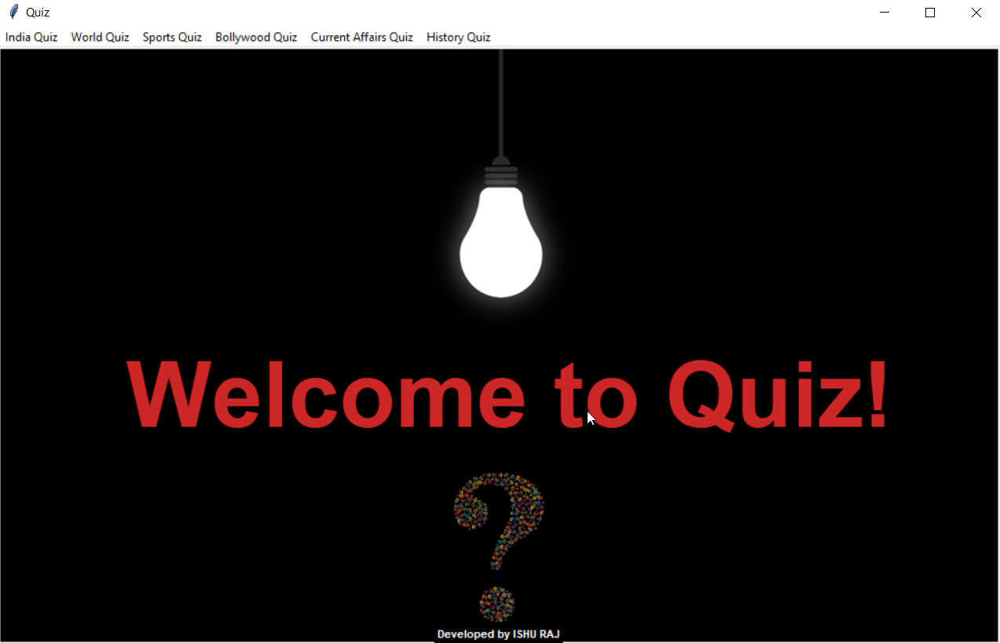
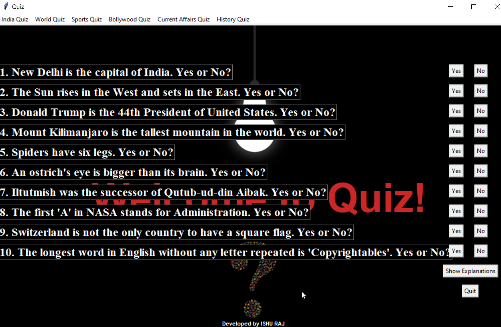

# Quiz-in-Python-with-GUI

The welcome screen consists of a menu bar with 6 menu items each corresponding to a particular field of knowledge.

Each menu has 3 options- Easy, Medium, Difficult.

Suppose you click on 'India Quiz' menu and select 'Easy', a quiz of 10 questions will open.

Each question will have 2 options- Yes, No.

You click on your answer and a messagebox will appear conveying the correctness of your chosen answer.

'Show Explanations' button opens a new window displaying explanations for selected questions.

'Quit' button closes the quiz window.

*As it is designed for the purpose of learning, all the options in all the menus will lead to the same 'India Quiz->Easy' quiz.
You can change the questions by creating new methods*

